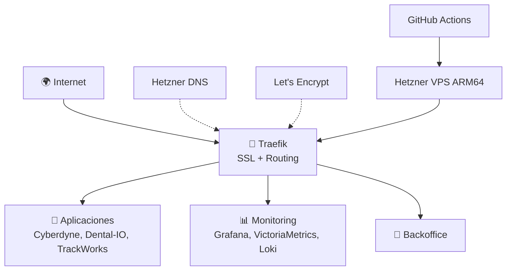

# 🚀 CodeSpartan Mambo Cloud Platform

Infraestructura como código (IaC) completa para despliegue automatizado en Hetzner Cloud ARM64 con Docker, Traefik, y stack de monitoreo completo.

## 🎯 Descripción

Plataforma de infraestructura completamente containerizada que proporciona:

- **VPS ARM64 en Hetzner** provisionado con Terraform
- **Traefik** como reverse proxy con SSL automático (Let's Encrypt)
- **Stack de monitoreo** completo (VictoriaMetrics + Grafana + Loki + Promtail + cAdvisor + Node Exporter)
- **Backoffice** con dashboard de gestión
- **CI/CD** completo con GitHub Actions
- **Múltiples aplicaciones** web con subdominios automáticos

### 🌐 Dominios y Subdominios

**Dominio principal**: `mambo-cloud.com` (DNS gestionado en Hetzner)

**Subdominios activos**:
- `traefik.mambo-cloud.com` - Dashboard de Traefik
- `grafana.mambo-cloud.com` - Monitoreo y métricas
- `backoffice.mambo-cloud.com` - Panel de control
- `www.mambo-cloud.com` - Aplicación principal
- `staging.mambo-cloud.com` - Entorno de pruebas
- `lab.mambo-cloud.com` - Entorno de desarrollo

## 🏗️ Arquitectura

**Plataforma replicable** diseñada con arquitectura Zero Trust para despliegue en múltiples VPS.

### Vista Simplificada (Estado Actual)



### Arquitectura Objetivo (Zero Trust)

**🎯 Roadmap de Seguridad:**
- ✅ Traefik Edge con SSL automático
- 🔄 docker-socket-proxy (en implementación)
- 🔄 Kong API Gateway por dominio
- 🔄 Authelia SSO + MFA
- 🔄 Portainer read-only
- 🔄 Aislamiento completo por red

**📖 Para ver la arquitectura completa, diagramas técnicos y roadmap detallado:**
- **[docs/ARCHITECTURE.md](docs/ARCHITECTURE.md)** - Arquitectura completa con diagramas de alto y bajo nivel

## 🚀 Quick Start

### Pre-requisitos

- [ ] Cuenta Hetzner Cloud + Token API
- [ ] Cuenta Hetzner DNS + Token API
- [ ] Repositorio GitHub
- [ ] Dominio `mambo-cloud.com` con NS apuntando a Hetzner

### 1. Configurar Secrets en GitHub

Ve a: **Settings → Secrets and variables → Actions**

```bash
HCLOUD_TOKEN=tu_token_hetzner_cloud
HETZNER_DNS_TOKEN=tu_token_hetzner_dns
VPS_SSH_HOST=91.98.137.217
VPS_SSH_USER=root
VPS_SSH_KEY=tu_clave_privada_ssh_completa
```

### 2. Despliegue automático

Ejecutar workflows en este orden:

```bash
1. 🏗️ Actions → "Deploy Infrastructure (Terraform)" → Run workflow
2. ⏳ Esperar 5-10 minutos (instalación Docker)
3. 🚪 Actions → "Deploy Traefik" → Run workflow
4. 📊 Actions → "Deploy Monitoring Stack" → Run workflow
5. 🏢 Actions → "Deploy Backoffice" → Run workflow
6. 🌐 Actions → "Deploy Mambo Cloud App" → Run workflow
```

### 3. Verificar despliegue

- https://traefik.mambo-cloud.com (admin/codespartan123)
- https://grafana.mambo-cloud.com (admin/codespartan123)
- https://backoffice.mambo-cloud.com (admin/codespartan123)
- https://www.mambo-cloud.com

## 📁 Estructura del Proyecto

```
codespartan/
├── infra/
│   ├── hetzner/                    # 🏗️ Terraform (VPS + DNS)
│   │   ├── main.tf                 # Recursos principales
│   │   ├── variables.tf            # Variables configurables
│   │   ├── terraform.tfvars        # Valores del proyecto
│   │   └── outputs.tf              # Outputs de Terraform
│   └── bootstrap/
│       └── provision.sh            # Script inicial del VPS
│
├── platform/
│   ├── traefik/                    # 🚪 Reverse Proxy
│   │   ├── docker-compose.yml      # Configuración Traefik
│   │   └── .env                    # Variables específicas
│   └── stacks/
│       ├── monitoring/             # 📊 VictoriaMetrics + Grafana + Loki + Promtail
│       └── backoffice/             # 🏢 Panel de control
│
├── apps/
│   ├── mambo-cloud/                # 🌐 Aplicación principal
│   ├── cyberdyne/                  # 🤖 App Cyberdyne Systems
│   └── dental-io/                  # 🦷 App Dental-IO
│
└── docs/
    ├── RUNBOOK.md                  # 📚 Guía operativa completa
    ├── BEGINNER.md                 # 👶 Guía para principiantes
    └── GITHUB.md                   # 🐙 Documentación GitHub Actions
```

## 🔧 Configuración

### Variables principales (terraform.tfvars)

```hcl
# VPS
server_name = "codespartan-vps"
server_type = "cax11"              # ARM64
location    = "nbg1"               # Nuremberg

# DNS  
domains    = ["mambo-cloud.com"]
subdomains = ["traefik", "grafana", "backoffice", "www", "staging", "lab"]

# IPs
manual_ipv4_address = "91.98.137.217"
manual_ipv6_address = "2a01:4f8:1c1a:7d21::1"
```

### Credenciales por defecto

```bash
# Todos los servicios web
Usuario: admin
Password: codespartan123
```

## 🛠️ Comandos Útiles

### Conectar al VPS

```bash
ssh root@91.98.137.217
```

### Verificar servicios

```bash
# Estado de contenedores
docker ps

# Logs en tiempo real
docker logs traefik -f
docker logs grafana -f

# Diagnósticos del sistema
/opt/codespartan/diagnostics.sh

# Monitor de contenedores
ctop
```

### Gestión de servicios

```bash
# Reiniciar Traefik
cd /opt/codespartan/platform/traefik
docker compose restart

# Actualizar aplicación
cd /opt/codespartan/apps/mambo-cloud
docker compose pull
docker compose up -d

# Ver logs centralizados
# → Ir a https://grafana.mambo-cloud.com → Explore → Loki
```

## 📊 Monitoreo

### Grafana Dashboard
- **URL**: https://grafana.mambo-cloud.com
- **Datasources**: VictoriaMetrics (métricas) + Loki (logs)
- **Dashboards**: Infraestructura, Traefik, Docker, Aplicaciones
- **Retención**: 7 días para métricas y logs

### Métricas disponibles
- CPU, RAM, Disco del VPS
- Métricas de contenedores Docker
- Request rate y response time de Traefik
- Estado de certificados SSL
- Logs centralizados de todas las aplicaciones

### Alertas configuradas
- CPU > 80% por 5min
- RAM > 90% por 3min
- Disco > 85%
- Servicio caído > 2min
- Certificado SSL expira < 7 días

## 🔄 CI/CD con GitHub Actions

### Workflows disponibles

| Workflow | Trigger | Descripción |
|----------|---------|-------------|
| `deploy-infrastructure.yml` | Manual + Push infra | Terraform: VPS + DNS |
| `deploy-traefik.yml` | Manual + Push traefik | Reverse proxy |
| `deploy-monitoring.yml` | Manual + Push monitoring | VictoriaMetrics + Grafana + Loki + Promtail |
| `deploy-backoffice.yml` | Manual + Push backoffice | Panel de control |
| `deploy-mambo-cloud.yml` | Manual + Push mambo-cloud | App principal |

### Despliegue automático

Cualquier `git push` en las carpetas correspondientes activa el despliegue automático.

```bash
# Ejemplo: Actualizar página principal
vim codespartan/apps/mambo-cloud/html/index.html
git add . && git commit -m "Update homepage"
git push origin main
# → GitHub Actions despliega automáticamente
```

## 🚨 Troubleshooting

### Servicio no accesible

```bash
# 1. Verificar contenedor
ssh root@91.98.137.217
docker ps | grep nombre_servicio

# 2. Ver logs
docker logs nombre_servicio

# 3. Verificar Traefik
curl -H "Host: tu-dominio.com" http://localhost
```

### SSL no funciona

```bash
# Verificar certificados
docker exec traefik ls -la /letsencrypt/

# Regenerar si es necesario
docker exec traefik rm -f /letsencrypt/acme.json
docker restart traefik
```

### DNS no resuelve

```bash
# Verificar registros
dig mambo-cloud.com
dig traefik.mambo-cloud.com

# Verificar en Hetzner Console
# → DNS → mambo-cloud.com → Records
```

## 📚 Documentación

### Arquitectura y Diseño
- **[ARCHITECTURE.md](docs/ARCHITECTURE.md)** - 🏗️ Arquitectura completa, diagramas de alto/bajo nivel, roadmap de seguridad

### Operaciones
- **[RUNBOOK.md](codespartan/docs/RUNBOOK.md)** - 📚 Guía operativa completa
- **[BEGINNER.md](codespartan/docs/BEGINNER.md)** - 👶 Tutorial para principiantes

### CI/CD y Deployment
- **[GITHUB.md](codespartan/docs/GITHUB.md)** - 🐙 Configuración GitHub Actions
- **[DEPLOY.md](DEPLOY.md)** - 🚀 Guía de despliegue paso a paso

### Seguridad y Alertas
- **[ALERTS.md](codespartan/docs/ALERTS.md)** - 🚨 Sistema de alertas y notificaciones

## 🔒 Seguridad

### Estado Actual
- ✅ **Firewall**: Hetzner Cloud Firewall (22, 80, 443)
- ✅ **SSL**: Certificados automáticos Let's Encrypt
- ✅ **Auth**: Autenticación básica en servicios de gestión
- ✅ **SSH**: Acceso solo por clave pública
- ⚠️ **Docker**: Red compartida (mejora en roadmap)
- ✅ **Fail2ban**: Protección SSH contra ataques

### Mejoras de Seguridad (Roadmap)
- 🔄 **docker-socket-proxy**: Filtro de seguridad para API de Docker (elimina acceso directo de Traefik)
- 🔄 **Redes aisladas**: Cada dominio en su red interna (sin comunicación cruzada)
- 🔄 **Kong API Gateway**: Rate limiting, auth y logging por dominio
- 🔄 **Authelia**: SSO con MFA para todos los dashboards
- 🔄 **Portainer**: Dashboard read-only protegido por Authelia

**📖 Ver arquitectura de seguridad completa:** [docs/ARCHITECTURE.md](docs/ARCHITECTURE.md)

## 🎯 Roadmap

### Seguridad (Prioridad Alta 🔴)
- [ ] **docker-socket-proxy** - Filtro de seguridad para Docker API
- [ ] **Aislamiento de redes** - Redes internas por dominio
- [ ] **Kong API Gateway** - Rate limiting y auth por dominio
- [ ] **Authelia** - SSO con MFA para dashboards
- [ ] **Portainer read-only** - Dashboard seguro de contenedores

### Infraestructura
- [ ] **Backups automáticos** (S3-compatible)
- [ ] **Alertas por email/Slack**
- [ ] **Multi-environment** (dev/staging/prod)
- [ ] **Blue/Green deployments**
- [ ] **Auto-scaling** con múltiples VPS
- [ ] **Disaster recovery** automation

### Replicabilidad
- [ ] **Template generator** - CLI para generar nueva instancia del stack
- [ ] **Multi-VPS management** - Gestionar múltiples despliegues desde un único repo

**📖 Ver roadmap detallado con fases:** [docs/ARCHITECTURE.md#estado-actual-vs-objetivo](docs/ARCHITECTURE.md#estado-actual-vs-objetivo)

## 📞 Soporte

- **Email**: infra@mambo-cloud.com
- **Repositorio**: https://github.com/CodeSpartan/iac-core-hetzner
- **Documentación**: [docs/](codespartan/docs/)

---

## 🏷️ Status Badges


**Licencia**: MIT  
**Mantenido por**: CodeSpartan Team  
**Última actualización**: $(date +%Y-%m-%d)
