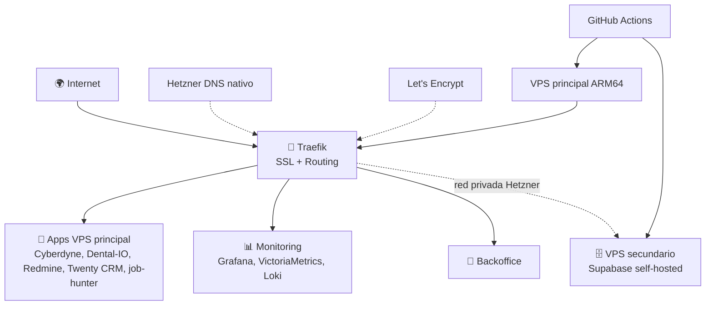

# 🚀 CodeSpartan Mambo Cloud Platform

Infraestructura como código (IaC) completa para despliegue automatizado en Hetzner Cloud ARM64 con Docker, Traefik, y stack de monitoreo completo.

## 🎯 Descripción

Plataforma de infraestructura completamente containerizada que proporciona:

- **VPS ARM64 en Hetzner** provisionado con Terraform
- **Traefik** como reverse proxy con SSL automático (Let's Encrypt)
- **Stack de monitoreo** completo (VictoriaMetrics + Grafana + Loki + Promtail + cAdvisor + Node Exporter)
- **Backoffice** con dashboard de gestión
- **CI/CD** completo con GitHub Actions
- **Múltiples aplicaciones** web con subdominios automáticos

### 🌐 Dominios y Subdominios

**Dominio principal**: `mambo-cloud.com` (DNS gestionado en Hetzner)

**Subdominios activos**:
- `traefik.mambo-cloud.com` - Dashboard de Traefik
- `grafana.mambo-cloud.com` - Monitoreo y métricas
- `backoffice.mambo-cloud.com` - Panel de control
- `www.mambo-cloud.com` - Aplicación principal
- `staging.mambo-cloud.com` - Entorno de pruebas
- `lab.mambo-cloud.com` - Entorno de desarrollo

**Otros dominios gestionados**: `cyberdyne-systems.es`, `codespartan.cloud`, `dental-io.com` (`codespartan.es`, la web corporativa, vive aparte en Hostinger/WordPress y no la gestiona este repo).

## 🏗️ Arquitectura

**Plataforma replicable** diseñada con arquitectura Zero Trust para despliegue en múltiples VPS.

### Vista Simplificada (Estado Actual)


```mermaid
graph TB
    Internet[🌍 Internet] --> Traefik[🚪 Traefik<br/>SSL + Routing]

    Traefik --> Apps[📱 Apps VPS principal<br/>Cyberdyne, Dental-IO, Redmine, Twenty CRM, job-hunter]
    Traefik --> Mon[📊 Monitoring<br/>Grafana, VictoriaMetrics, Loki]
    Traefik --> Back[🏢 Backoffice]
    Traefik -.->|red privada Hetzner| Apis[🗄️ VPS secundario<br/>Supabase self-hosted]

    DNS[Hetzner DNS nativo] -.-> Traefik
    LE[Let's Encrypt] -.-> Traefik

    CI[GitHub Actions] --> VPS[VPS principal ARM64]
    CI --> Apis
    VPS --> Traefik
```

### Arquitectura Zero Trust (Estado Actual)

- ✅ Traefik Edge con SSL automático
- ✅ docker-socket-proxy (proxy de solo lectura al socket Docker)
- ✅ Authelia SSO + MFA (protege Traefik, Grafana, Backoffice, Portainer)
- ✅ Portainer read-only, protegido por Authelia
- ✅ Aislamiento de red por producto (Redmine, Supabase, Twenty CRM)
- ✅ Kong API Gateway para Supabase (incluido en su propio stack)
- 🔄 Kong API Gateway pendiente para otros dominios (dental-io, mambo-cloud) — plantilla en `platform/kong/_TEMPLATE/`

**📖 Para ver la arquitectura completa, diagramas técnicos y roadmap detallado:**
- **[Arquitectura Completa](docs/02-architecture/ARCHITECTURE.md)** - Arquitectura completa con diagramas de alto y bajo nivel

## 🚀 Quick Start

### Pre-requisitos

- [ ] Cuenta Hetzner Cloud + Token API (cubre Cloud + DNS nativo, `hcloud_zone`)
- [ ] Repositorio GitHub
- [ ] Dominio `mambo-cloud.com` con NS apuntando a Hetzner

### 1. Configurar Secrets en GitHub

Ve a: **Settings → Secrets and variables → Actions**

```bash
HCLOUD_TOKEN=tu_token_hetzner_cloud              # Cubre Cloud + DNS (hcloud_zone)
VPS_SSH_PUBLIC_KEY=tu_clave_publica_ssh          # Provisionada en el VPS principal
APIS_DEPLOY_SSH_PUBLIC_KEY=tu_clave_publica_ssh  # Usuario deploy del VPS secundario
VPS_SSH_HOST=91.98.137.217
VPS_SSH_USER=leonidas
VPS_SSH_KEY=tu_clave_privada_ssh_completa
```

### 2. Despliegue automático

Ejecutar workflows en este orden:

```bash
1. 🏗️ Actions → "Deploy Infrastructure (Terraform)" → Run workflow
2. ⏳ Esperar 5-10 minutos (instalación Docker)
3. 🚪 Actions → "Deploy Traefik" → Run workflow
4. 📊 Actions → "Deploy Monitoring Stack" → Run workflow
5. 🏢 Actions → "Deploy Backoffice" → Run workflow
6. 🌐 Actions → "Deploy Mambo Cloud App" → Run workflow
```

### 3. Verificar despliegue

- https://traefik.mambo-cloud.com (admin/codespartan123)
- https://grafana.mambo-cloud.com (admin/codespartan123)
- https://backoffice.mambo-cloud.com (admin/codespartan123)
- https://www.mambo-cloud.com

## 📁 Estructura del Proyecto

```
codespartan/
├── infra/
│   ├── hetzner/                    # 🏗️ Terraform (2 VPS + DNS nativo hcloud)
│   │   ├── main.tf                 # Recursos principales
│   │   ├── variables.tf            # Variables configurables
│   │   ├── terraform.tfvars        # Valores del proyecto
│   │   └── outputs.tf              # Outputs de Terraform
│   └── bootstrap/
│       └── provision.sh            # Script inicial del VPS
│
├── platform/
│   ├── traefik/                    # 🚪 Reverse Proxy
│   ├── authelia/                   # 🔐 SSO + MFA
│   ├── docker-socket-proxy/        # 🛡️ Proxy read-only al socket Docker
│   ├── portainer/                  # 📦 Gestión de contenedores (tras Authelia)
│   ├── watchtower/                 # 🔄 Auto-actualización de imágenes
│   ├── kong/_TEMPLATE/             # 🌉 Plantilla API Gateway (por dominio)
│   ├── supabase/                   # 🗄️ Supabase self-hosted (VPS secundario)
│   └── stacks/
│       ├── monitoring/             # 📊 VictoriaMetrics + Grafana + Loki + Promtail
│       └── backoffice/             # 🏢 Panel de control
│
├── apps/
│   ├── codespartan-cloud/          # 🌐 www, ui, redmine, crm (Twenty), job-hunter
│   ├── cyberdyne-systems-es/       # 🤖 App Cyberdyne Systems (sobre Supabase)
│   ├── dental-io-com/              # 🦷 App Dental-IO
│   └── mambo-cloud-com/            # ☁️ Aplicación principal mambo-cloud
│
└── docs/
    ├── README.md                   # 📚 Índice completo de documentación
    ├── 03-operations/RUNBOOK.md    # 📚 Guía operativa completa
    └── 01-getting-started/BEGINNER.md  # 👶 Guía para principiantes
```

## 🔧 Configuración

### Variables principales (terraform.tfvars)

```hcl
# VPS
server_name = "codespartan-vps"
server_type = "cax11"              # ARM64
location    = "nbg1"               # Nuremberg

# DNS  
domains    = ["mambo-cloud.com"]
subdomains = ["traefik", "grafana", "backoffice", "www", "staging", "lab"]

# IPs
manual_ipv4_address = "91.98.137.217"
manual_ipv6_address = "2a01:4f8:1c1a:7d21::1"
```

### Credenciales por defecto

```bash
# Todos los servicios web
Usuario: admin
Password: codespartan123
```

## 🛠️ Comandos Útiles

### Conectar al VPS

```bash
ssh leonidas@91.98.137.217
```

### Verificar servicios

```bash
# Estado de contenedores
docker ps

# Logs en tiempo real
docker logs traefik -f
docker logs grafana -f

# Diagnósticos del sistema
/opt/codespartan/diagnostics.sh

# Monitor de contenedores
ctop
```

### Gestión de servicios

```bash
# Reiniciar Traefik
cd /opt/codespartan/platform/traefik
docker compose restart

# Actualizar aplicación
cd /opt/codespartan/apps/mambo-cloud
docker compose pull
docker compose up -d

# Ver logs centralizados
# → Ir a https://grafana.mambo-cloud.com → Explore → Loki
```

## 📊 Monitoreo

### Grafana Dashboard
- **URL**: https://grafana.mambo-cloud.com
- **Datasources**: VictoriaMetrics (métricas) + Loki (logs)
- **Dashboards**: Infraestructura, Traefik, Docker, Aplicaciones
- **Retención**: 7 días para métricas y logs

### Métricas disponibles
- CPU, RAM, Disco del VPS
- Métricas de contenedores Docker
- Request rate y response time de Traefik
- Estado de certificados SSL
- Logs centralizados de todas las aplicaciones

### Alertas configuradas
- CPU > 80% por 5min
- RAM > 90% por 3min
- Disco > 85%
- Servicio caído > 2min
- Certificado SSL expira < 7 días

## 🔄 CI/CD con GitHub Actions

### Workflows disponibles

| Workflow | Trigger | Descripción |
|----------|---------|-------------|
| `deploy-infrastructure.yml` | Manual + Push infra | Terraform: VPS + DNS |
| `deploy-traefik.yml` | Manual + Push traefik | Reverse proxy |
| `deploy-monitoring.yml` | Manual + Push monitoring | VictoriaMetrics + Grafana + Loki + Promtail |
| `deploy-backoffice.yml` | Manual + Push backoffice | Panel de control |
| `deploy-mambo-cloud.yml` | Manual + Push mambo-cloud | App principal |

### Despliegue automático

Cualquier `git push` en las carpetas correspondientes activa el despliegue automático.

```bash
# Ejemplo: Actualizar página principal
vim codespartan/apps/mambo-cloud/html/index.html
git add . && git commit -m "Update homepage"
git push origin main
# → GitHub Actions despliega automáticamente
```

## 🚨 Troubleshooting

### Servicio no accesible

```bash
# 1. Verificar contenedor
ssh leonidas@91.98.137.217
docker ps | grep nombre_servicio

# 2. Ver logs
docker logs nombre_servicio

# 3. Verificar Traefik
curl -H "Host: tu-dominio.com" http://localhost
```

### SSL no funciona

```bash
# Verificar certificados
docker exec traefik ls -la /letsencrypt/

# Regenerar si es necesario
docker exec traefik rm -f /letsencrypt/acme.json
docker restart traefik
```

### DNS no resuelve

```bash
# Verificar registros
dig mambo-cloud.com
dig traefik.mambo-cloud.com

# Verificar en Hetzner Console
# → DNS → mambo-cloud.com → Records
```

## 📚 Documentación

Toda la documentación está organizada en [docs/](docs/). Ver el [índice completo](docs/README.md) para navegar toda la documentación.

### Quick Start
- **[Guía para Principiantes](docs/01-getting-started/BEGINNER.md)** - Tutorial paso a paso
- **[Quick Start](docs/01-getting-started/QUICK_START.md)** - Despliegue rápido en 5 pasos

### Arquitectura
- **[Arquitectura Completa](docs/02-architecture/ARCHITECTURE.md)** - Arquitectura Zero Trust con diagramas
- **[System Overview](docs/02-architecture/OVERVIEW.md)** - Visión general del sistema

### Operaciones
- **[Runbook Operativo](docs/03-operations/RUNBOOK.md)** - Guía operativa completa
- **[Gestión de Aplicaciones](docs/03-operations/APPLICATIONS.md)** - Cómo gestionar aplicaciones
- **[Monitoreo y Alertas](docs/03-operations/MONITORING.md)** - Sistema de alertas

### Despliegue
- **[Guía de Despliegue](docs/04-deployment/DEPLOYMENT.md)** - Despliegue paso a paso
- **[CI/CD con GitHub Actions](docs/04-deployment/GITHUB.md)** - Configuración GitHub Actions

### Seguridad
- **[Authelia SSO](docs/05-security/AUTHELIA.md)** - Single Sign-On con MFA
- **[Fail2ban](docs/05-security/FAIL2BAN.md)** - Protección SSH
- **[Gestión de Secretos](docs/05-security/SECRET_MANAGEMENT.md)** - Gestión segura de secretos

## 🔒 Seguridad

### Estado Actual
- ✅ **Firewall**: Hetzner Cloud Firewall (22, 80, 443)
- ✅ **SSL**: Certificados automáticos Let's Encrypt
- ✅ **SSH**: Acceso solo por clave pública, usuario no-root (`leonidas`)
- ✅ **Fail2ban**: Protección SSH contra ataques
- ✅ **docker-socket-proxy**: Traefik y Portainer acceden a Docker vía proxy de solo lectura
- ✅ **Authelia**: SSO con MFA para todos los dashboards de administración
- ✅ **Portainer**: Dashboard read-only, protegido por Authelia
- ✅ **Redes aisladas**: bases de datos aisladas por producto (Redmine, Supabase, Twenty CRM)

### Pendiente
- 🔄 **Kong API Gateway**: solo pendiente para dominios distintos de Cyberdyne/Supabase (dental-io, mambo-cloud) — plantilla en `platform/kong/_TEMPLATE/`

**Ver arquitectura de seguridad completa:** [docs/02-architecture/ARCHITECTURE.md](docs/02-architecture/ARCHITECTURE.md)

## 🎯 Roadmap

### Seguridad
- [x] **docker-socket-proxy** - Filtro de seguridad para Docker API
- [x] **Aislamiento de redes** - Redes internas por dominio/producto
- [x] **Authelia** - SSO con MFA para dashboards
- [x] **Portainer read-only** - Dashboard seguro de contenedores
- [ ] **Kong API Gateway** - Pendiente para dominios distintos de Cyberdyne/Supabase (dental-io, mambo-cloud)

### Infraestructura
- [ ] **Backups automáticos** (S3-compatible)
- [ ] **Alertas por email/Slack**
- [ ] **Multi-environment** (dev/staging/prod)
- [ ] **Blue/Green deployments**
- [ ] **Auto-scaling** con múltiples VPS
- [ ] **Disaster recovery** automation

### Replicabilidad
- [ ] **Template generator** - CLI para generar nueva instancia del stack
- [ ] **Multi-VPS management** - Gestionar múltiples despliegues desde un único repo

**Ver roadmap detallado con fases:** [docs/02-architecture/ARCHITECTURE.md#estado-actual-vs-objetivo](docs/02-architecture/ARCHITECTURE.md#estado-actual-vs-objetivo)

## 📞 Soporte

- **Email**: infra@mambo-cloud.com
- **Repositorio**: https://github.com/TechnoSpartan/iac-code-spartan
- **Documentación**: [docs/](docs/)

---

## 🏷️ Status Badges


**Licencia**: MIT  
**Mantenido por**: CodeSpartan Team  
**Última actualización**: $(date +%Y-%m-%d)
