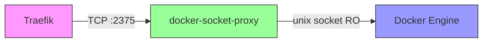

# 🔒 docker-socket-proxy - FASE 1 (Zero Trust Security)

## Descripción

**docker-socket-proxy** es un proxy de seguridad que filtra el acceso al Docker API, permitiendo **SOLO operaciones de lectura (GET)** y bloqueando todas las operaciones peligrosas como crear, eliminar o ejecutar comandos en contenedores.

### ¿Por qué es necesario?

**Antes (❌ Inseguro):**
```
Traefik → /var/run/docker.sock (acceso total)
```

Si Traefik es comprometido, el atacante tiene **control total de Docker**:
- ✅ Crear/eliminar contenedores
- ✅ Ejecutar comandos en contenedores
- ✅ Acceder a todos los volúmenes y redes
- ✅ Leer secrets y variables de entorno

**Después (✅ Seguro):**
```
Traefik → docker-socket-proxy (filtro) → /var/run/docker.sock
```

Traefik SOLO puede:
- ✅ Listar contenedores (para routing)
- ✅ Listar redes (para service discovery)
- ❌ NO puede crear/eliminar contenedores
- ❌ NO puede ejecutar comandos
- ❌ NO puede acceder a volúmenes

## Arquitectura



### Componentes

1. **docker-socket-proxy** (`172.19.x.x/24` - red interna)
   - Imagen: `tecnativa/docker-socket-proxy:latest`
   - Puerto: 2375 (TCP, red interna)
   - Socket: `/var/run/docker.sock:ro` (READ-ONLY)

2. **Traefik** (redes: `web` + `docker_api`)
   - Endpoint: `tcp://docker-socket-proxy:2375`
   - Ya NO monta el socket directamente

## Operaciones Permitidas/Bloqueadas

### ✅ Permitidas (GET)
- `CONTAINERS=1` - Listar contenedores
- `NETWORKS=1` - Listar redes
- `SERVICES=1` - Listar servicios (Swarm)
- `TASKS=1` - Listar tasks (Swarm)
- `INFO=1` - Información del sistema
- `EVENTS=1` - Stream de eventos
- `VERSION=1` - Versión de Docker
- `PING=1` - Health checks

### ❌ Bloqueadas (POST/PUT/DELETE/PATCH)
- `POST=0` - Crear recursos
- `DELETE=0` - Eliminar recursos
- `PUT=0` - Actualizar recursos
- `PATCH=0` - Modificar recursos
- `EXEC=0` - Ejecutar comandos
- `BUILD=0` - Construir imágenes
- `COMMIT=0` - Commit de contenedores
- `SECRETS=0` - Gestión de secrets
- `VOLUMES=0` - Gestión de volúmenes
- `IMAGES=0` - Gestión de imágenes

## Deployment

### Manual

```bash
ssh root@91.98.137.217
cd /opt/codespartan/platform/docker-socket-proxy
./deploy.sh
```

El script hace:
1. ✅ Validaciones pre-deployment
2. 💾 Backup de configuración actual
3. 🚀 Deploy docker-socket-proxy
4. 🔍 Health check (espera hasta 60s)
5. 🔄 Actualiza Traefik con nuevo endpoint
6. 🔍 Health check de Traefik (espera hasta 60s)
7. ✅ Verificación de conectividad
8. 🧹 Limpieza de backups antiguos
9. 🔄 **Rollback automático en caso de fallo**

### Automatizado (CI/CD)

```bash
# Trigger manual
gh workflow run deploy-docker-socket-proxy.yml

# O push cambios
git add codespartan/platform/docker-socket-proxy/
git commit -m "Update docker-socket-proxy config"
git push origin main
# → GitHub Actions despliega automáticamente
```

**Workflow**: `.github/workflows/deploy-docker-socket-proxy.yml`

## Verificación

### 1. Estado de contenedores

```bash
docker ps | grep -E 'docker-socket-proxy|traefik'
```

Deberías ver ambos contenedores **healthy**.

### 2. Logs de docker-socket-proxy

```bash
docker logs docker-socket-proxy --tail 50
```

No debería haber errores.

### 3. Logs de Traefik

```bash
docker logs traefik | grep -i "docker\|provider"
```

Deberías ver mensajes de "Provider connection established" sin errores.

### 4. Test de conectividad

```bash
# Desde el VPS
curl http://localhost:8080/ping
# Debería devolver: OK

# Dashboard de Traefik
curl -I https://traefik.mambo-cloud.com
# Debería devolver: HTTP/1.1 401 Unauthorized (requiere auth)
```

### 5. Verificar que el socket está protegido

```bash
# Traefik NO debería poder ejecutar comandos
docker exec traefik ls /var/run/docker.sock
# Debería devolver error: "No such file or directory"
```

## Rollback

Si algo falla, el script hace rollback automático. Para rollback manual:

```bash
cd /opt/codespartan/platform/docker-socket-proxy

# Detener docker-socket-proxy
docker compose down --volumes --remove-orphans

# Restaurar Traefik anterior
cd /opt/codespartan/platform/traefik
# Recuperar backup de /tmp/traefik-backup-*
cp -r /tmp/traefik-backup-*/traefik/* .
docker compose down --remove-orphans
docker rm -f traefik 2>/dev/null || true
docker compose up -d
```

## Recursos

- **CPU**: 0.15 cores (límite), 0.05 cores (reserva)
- **RAM**: 128MB (límite), 32MB (reserva)
- **Red**: `docker_api` (interna, sin internet)

## Troubleshooting

### Problema: "Pool overlaps with other one"

```bash
# La subnet ya existe o hay conflicto
# docker-compose.yml está configurado para auto-seleccionar subnet libre
# Si persiste, eliminar redes huérfanas:
docker network prune
```

### Problema: "Container name already in use"

```bash
# Hay contenedores huérfanos
docker rm -f traefik docker-socket-proxy 2>/dev/null || true
docker compose up -d
```

### Problema: Traefik no puede descubrir contenedores

```bash
# Verificar que están en la misma red
docker network inspect docker_api
# Deberías ver tanto traefik como docker-socket-proxy

# Verificar logs
docker logs traefik | grep -i error
```

## Próximos pasos

✅ **FASE 1 completada**

Siguiente: **FASE 2 - Authelia SSO** (ver `docs/IMPLEMENTATION_PLAN.md`)
- Autenticación centralizada con MFA
- SSO para todos los dashboards (Traefik, Grafana, Portainer)
- Protección adicional para servicios de gestión

