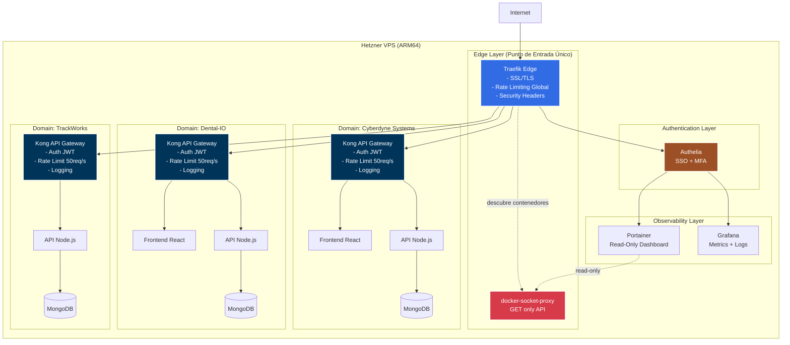
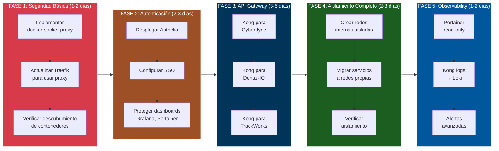

# 🏗️ Arquitectura CodeSpartan Mambo Cloud Platform

Este documento describe la arquitectura de la plataforma, su estado actual, y el roadmap hacia una arquitectura Zero Trust con aislamiento completo.

## 📋 Tabla de Contenidos

1. [Diagrama de Alto Nivel](#diagrama-de-alto-nivel)
2. [Diagrama de Bajo Nivel (Técnico)](#diagrama-de-bajo-nivel-técnico)
3. [Estado Actual vs Objetivo](#estado-actual-vs-objetivo)
4. [Áreas de Mejora](#áreas-de-mejora)
5. [Glosario de Conceptos](#glosario-de-conceptos)

---

## 🌐 Diagrama de Alto Nivel

### Arquitectura Objetivo (Target State)



### Flujo de Tráfico

```
1️⃣ Usuario → https://api.cyberdyne-systems.es/v1/tasks
   └─ DNS → 91.98.137.217 (VPS IP)

2️⃣ Traefik Edge
   ├─ ✅ Valida certificado SSL (Let's Encrypt)
   ├─ ✅ Rate limit global: 100 req/s por IP
   ├─ ✅ Security headers (HSTS, XSS, CSP)
   └─ 🔍 Descubre contenedores vía docker-socket-proxy (GET only)

3️⃣ Authelia (opcional según ruta)
   ├─ ✅ Verifica JWT/OAuth token
   ├─ ✅ Valida MFA si está habilitado
   └─ ✅ Session management

4️⃣ Kong API Gateway (Cyberdyne)
   ├─ ✅ Rate limit específico: 50 req/s por API key
   ├─ ✅ Request/Response transformation
   ├─ ✅ Logging detallado (JSON)
   ├─ ✅ CORS policies
   └─ ✅ Circuit breaker

5️⃣ Cyberdyne API
   ├─ Lógica de negocio
   └─ MongoDB query

6️⃣ Respuesta
   └─ API → Kong → Traefik → Usuario
```

---

## 🔧 Diagrama de Bajo Nivel (Técnico)

### Arquitectura de Redes Docker

```mermaid
graph TB
    subgraph NetworkWeb["Docker Network: web (external)"]
        Traefik[Traefik Edge<br/>container_name: traefik]
        DSP[docker-socket-proxy<br/>container_name: docker-socket-proxy]
        Authelia[Authelia<br/>container_name: authelia]
        Portainer[Portainer<br/>container_name: portainer]
        Grafana[Grafana<br/>container_name: grafana]
    end

    subgraph NetworkCyber["Docker Network: cyberdyne_internal (isolated)"]
        KongCyber[Kong Cyberdyne<br/>container_name: kong-cyberdyne]
        CyberFront[Frontend<br/>container_name: cyberdyne-frontend]
        CyberAPI[API<br/>container_name: cyberdyne-api]
        CyberDB[MongoDB<br/>container_name: cyberdyne-mongodb]

        KongCyber --> CyberFront
        KongCyber --> CyberAPI
        CyberAPI --> CyberDB
    end

    subgraph NetworkDental["Docker Network: dental_internal (isolated)"]
        KongDental[Kong Dental<br/>container_name: kong-dental]
        DentalFront[Frontend<br/>container_name: dental-frontend]
        DentalAPI[API<br/>container_name: dental-api]
        DentalDB[MongoDB<br/>container_name: dental-mongodb]

        KongDental --> DentalFront
        KongDental --> DentalAPI
        DentalAPI --> DentalDB
    end

    subgraph NetworkTrack["Docker Network: trackworks_internal (isolated)"]
        KongTrack[Kong TrackWorks<br/>container_name: kong-trackworks]
        TrackAPI[API<br/>container_name: trackworks-api]
        TrackDB[MongoDB<br/>container_name: trackworks-mongodb]

        KongTrack --> TrackAPI
        TrackAPI --> TrackDB
    end

    subgraph HostResources["Host Resources"]
        DockerSocket["/var/run/docker.sock<br/>(Docker Engine)"]
        VolTraefik["/opt/codespartan/platform/traefik/letsencrypt"]
        VolCyberDB["/opt/codespartan/data/cyberdyne/mongodb"]
        VolDentalDB["/opt/codespartan/data/dental/mongodb"]
        VolTrackDB["/opt/codespartan/data/trackworks/mongodb"]
    end

    Traefik -->|HTTP GET| DSP
    DSP -->|Unix Socket| DockerSocket
    Portainer -->|HTTP GET| DSP

    Traefik -.->|bridged via web| KongCyber
    Traefik -.->|bridged via web| KongDental
    Traefik -.->|bridged via web| KongTrack

    KongCyber -.->|dual-homed| NetworkWeb
    KongDental -.->|dual-homed| NetworkWeb
    KongTrack -.->|dual-homed| NetworkWeb

    Traefik -->|volume mount| VolTraefik
    CyberDB -->|volume mount| VolCyberDB
    DentalDB -->|volume mount| VolDentalDB
    TrackDB -->|volume mount| VolTrackDB

    style NetworkWeb fill:#e1f5ff,stroke:#01579b,stroke-width:2px
    style NetworkCyber fill:#fff3e0,stroke:#e65100,stroke-width:2px
    style NetworkDental fill:#f3e5f5,stroke:#4a148c,stroke-width:2px
    style NetworkTrack fill:#e8f5e9,stroke:#1b5e20,stroke-width:2px
    style HostResources fill:#fafafa,stroke:#424242,stroke-width:2px
    style DSP fill:#d73a49,stroke:#fff,stroke-width:3px,color:#fff
```



### Configuración Técnica de Seguridad

```yaml
# docker-socket-proxy: Filtro de Seguridad
services:
  docker-socket-proxy:
    image: tecnativa/docker-socket-proxy:latest
    container_name: docker-socket-proxy
    environment:
      # ✅ Operaciones permitidas (GET only)
      CONTAINERS: 1       # Listar contenedores
      NETWORKS: 1         # Listar redes
      SERVICES: 0         # Swarm services (no usado)
      TASKS: 0            # Swarm tasks (no usado)

      # ❌ Operaciones bloqueadas (POST/DELETE)
      POST: 0             # Crear recursos
      DELETE: 0           # Eliminar recursos
      BUILD: 0            # Construir imágenes
      COMMIT: 0           # Commit contenedores
      CONFIGS: 0          # Docker configs
      VOLUMES: 0          # Crear volúmenes
      EXEC: 0             # Ejecutar comandos
      IMAGES: 0           # Gestionar imágenes
      INFO: 1             # Info del sistema (safe)
      EVENTS: 1           # Event stream (safe)
    volumes:
      - /var/run/docker.sock:/var/run/docker.sock:ro
    networks:
      - web
    restart: unless-stopped
    deploy:
      resources:
        limits:
          cpus: '0.15'
          memory: 128M
```

```yaml
# Traefik: Sin acceso directo al socket
services:
  traefik:
    image: traefik:v3.6.1
    command:
      # 🔒 Conecta a docker-socket-proxy en lugar del socket
      - --providers.docker.endpoint=tcp://docker-socket-proxy:2375
      # ❌ NO usa: unix:///var/run/docker.sock
    volumes:
      # ❌ NO monta el socket
      # - /var/run/docker.sock:/var/run/docker.sock
      - ./letsencrypt:/letsencrypt
    networks:
      - web
```

```yaml
# Kong API Gateway: Dual-homed (2 redes)
services:
  kong-cyberdyne:
    image: kong:3.4-alpine
    container_name: kong-cyberdyne
    networks:
      - web                    # Para recibir tráfico de Traefik
      - cyberdyne_internal     # Para conectar con servicios internos
    environment:
      KONG_DATABASE: "off"
      KONG_DECLARATIVE_CONFIG: /kong/declarative/kong.yml
      KONG_PROXY_LISTEN: "0.0.0.0:8000"
      KONG_ADMIN_LISTEN: "0.0.0.0:8001"
    labels:
      - traefik.enable=true
      - traefik.http.routers.kong-cyberdyne.rule=Host(`api.cyberdyne-systems.es`)
      - traefik.docker.network=web
```

---

## 🔄 Estado Actual vs Objetivo

### Matriz de Comparación

| Componente | Estado Actual | Estado Objetivo | Prioridad |
|------------|---------------|-----------------|-----------|
| **Traefik Edge** | ✅ Implementado | ⚠️ Mejorar (docker-socket-proxy) | 🔴 Alta |
| **docker-socket-proxy** | ❌ No implementado | 🎯 Implementar | 🔴 Alta |
| **Kong API Gateway** | ❌ No implementado | 🎯 1 por dominio | 🟡 Media |
| **Authelia** | ❌ No implementado | 🎯 SSO global | 🟡 Media |
| **Portainer** | ❌ No implementado | 🎯 Read-only + Authelia | 🟢 Baja |
| **Redes Aisladas** | ⚠️ Parcial (algunos dominios) | 🎯 Completo (todos los dominios) | 🔴 Alta |
| **Monitoring** | ✅ VictoriaMetrics + Grafana | ✅ Funcional | ✅ OK |
| **CI/CD** | ✅ GitHub Actions | ✅ Funcional | ✅ OK |

### Diagrama de Migración



---

## 🎯 Áreas de Mejora

### 1. Seguridad (CRÍTICO 🔴)

#### Problema Actual
```yaml
# ⚠️ Traefik tiene acceso COMPLETO al Docker socket
volumes:
  - /var/run/docker.sock:/var/run/docker.sock:ro
```

**Riesgos:**
- Si Traefik es comprometido → atacante controla todo Docker
- Puede crear contenedores privilegiados
- Puede escalar privilegios al host
- Puede leer secretos de otros contenedores

#### Solución
```yaml
# ✅ Traefik usa docker-socket-proxy (filtro de seguridad)
command:
  - --providers.docker.endpoint=tcp://docker-socket-proxy:2375

# docker-socket-proxy tiene el socket, pero solo expone GET
docker-socket-proxy:
  environment:
    CONTAINERS: 1
    POST: 0
    DELETE: 0
    EXEC: 0
  volumes:
    - /var/run/docker.sock:/var/run/docker.sock:ro
```

**Beneficios:**
- ✅ Traefik solo puede LEER contenedores
- ✅ No puede crear, eliminar o ejecutar comandos
- ✅ Principio de mínimo privilegio
- ✅ Superficie de ataque reducida

### 2. Aislamiento de Redes (CRÍTICO 🔴)

#### Problema Actual
```
Algunos dominios comparten la red "web"
→ Frontend de Cyberdyne puede hablar con DB de Dental
→ No hay aislamiento real entre aplicaciones
```

#### Solución
```yaml
# Cada dominio tiene su red interna
networks:
  web:
    external: true              # Solo Traefik + Kong gateways

  cyberdyne_internal:
    driver: bridge
    internal: true              # No acceso a Internet
    ipam:
      config:
        - subnet: 172.22.0.0/24

  dental_internal:
    driver: bridge
    internal: true
    ipam:
      config:
        - subnet: 172.23.0.0/24
```

**Kong como puente seguro:**
```yaml
services:
  kong-cyberdyne:
    networks:
      - web                    # Recibe tráfico externo
      - cyberdyne_internal     # Accede a servicios internos

  cyberdyne-api:
    networks:
      - cyberdyne_internal     # SOLO red interna
      # NO tiene acceso a "web"
```

### 3. API Gateway por Dominio (MEDIA 🟡)

#### ¿Por qué Kong?

**Sin Kong (actual):**
```
Traefik → directamente a API
  └─ No rate limiting específico por API
  └─ No transformación de requests
  └─ No logging detallado
  └─ No plugins de autenticación avanzada
```

**Con Kong:**
```
Traefik → Kong → API
  ├─ Rate limiting: 50 req/s por API key
  ├─ Request/Response transformation
  ├─ Logging en JSON estructurado → Loki
  ├─ CORS policies dinámicas
  ├─ Circuit breaker ante fallos
  ├─ Auth plugins: JWT, OAuth, API keys
  └─ Métricas Prometheus por endpoint
```

**Ejemplo de configuración Kong:**
```yaml
# kong.yml (declarative config)
_format_version: "3.0"

services:
  - name: cyberdyne-api
    url: http://cyberdyne-api:3000
    routes:
      - name: tasks-route
        paths:
          - /v1/tasks
        methods:
          - GET
          - POST
    plugins:
      - name: rate-limiting
        config:
          minute: 60
          policy: local

      - name: jwt
        config:
          key_claim_name: iss

      - name: cors
        config:
          origins:
            - https://www.cyberdyne-systems.es
```

### 4. Autenticación Centralizada (MEDIA 🟡)

#### Authelia como SSO

**Problema actual:**
- Cada dashboard tiene su propio usuario/password
- No hay 2FA
- No hay gestión centralizada de sesiones

**Con Authelia:**
```
Usuario → https://portainer.mambo-cloud.com
           ↓
       Traefik (middleware: authelia)
           ↓
       Authelia verifica:
         ├─ Usuario existe
         ├─ Password correcto
         ├─ 2FA (TOTP/WebAuthn)
         └─ Sesión activa
           ↓
       Si OK → Portainer
       Si NO → Página de login Authelia
```

**Beneficios:**
- ✅ Single Sign-On (1 login para todos los dashboards)
- ✅ MFA obligatorio
- ✅ Gestión centralizada de usuarios
- ✅ Logs de auditoría de accesos

### 5. Portainer Read-Only (BAJA 🟢)

#### Configuración Segura

```yaml
services:
  portainer:
    image: portainer/portainer-ce:latest
    command:
      - --no-analytics
      - --hide-label=com.docker.compose.project
    environment:
      # Variables para modo restrictivo
      PORTAINER_READONLY: "true"

    # NO monta docker.sock directamente
    # Usa docker-socket-proxy

    labels:
      - traefik.enable=true
      - traefik.http.routers.portainer.rule=Host(`portainer.mambo-cloud.com`)
      - traefik.http.routers.portainer.middlewares=authelia@docker

    networks:
      - web
```

**Capacidades en modo read-only:**
- ✅ Ver contenedores y su estado
- ✅ Ver logs en tiempo real
- ✅ Ver stacks de Docker Compose
- ✅ Ver redes y volúmenes
- ❌ NO puede crear/eliminar contenedores
- ❌ NO puede ejecutar comandos
- ❌ NO puede modificar configuraciones

---

## 📚 Glosario de Conceptos

### docker-socket-proxy
**¿Qué es?** Un proxy de seguridad que filtra operaciones al Docker Engine.

**Analogía:** Es como un portero en un edificio. Traefik le pregunta "¿qué contenedores hay?" y el portero le responde. Pero si Traefik intenta decir "elimina este contenedor", el portero dice "NO, eso no está permitido".

**Tecnología:** Contenedor basado en HAProxy que intercepta llamadas a la API de Docker y solo permite operaciones GET (lectura).

**Configuración:**
```bash
# Permitir: Listar contenedores
CONTAINERS=1

# Bloquear: Crear contenedores
POST=0

# Bloquear: Eliminar contenedores
DELETE=0

# Bloquear: Ejecutar comandos dentro de contenedores
EXEC=0
```

### Docker Socket (`/var/run/docker.sock`)
**¿Qué es?** Un archivo especial (Unix socket) que es la puerta de entrada a la API de Docker.

**Analogía:** Es como el panel de control maestro del edificio Docker. Quien tiene acceso a este socket puede:
- Ver todos los contenedores
- Crear nuevos contenedores
- Eliminar contenedores
- Ejecutar comandos dentro de contenedores
- Leer secretos y variables de entorno
- Montar volúmenes del host

**Ubicación:** `/var/run/docker.sock` (en el host)

**Peligro:** Si montas este socket en un contenedor, ese contenedor tiene control TOTAL sobre Docker (y por extensión, sobre el host).

### Kong API Gateway
**¿Qué es?** Un API Gateway que se sitúa entre Traefik y tus aplicaciones.

**Analogía:** Traefik es el guardia de seguridad en la entrada del edificio (maneja HTTPS, certificados). Kong es el recepcionista inteligente en cada piso que:
- Verifica tu credencial (JWT/API key)
- Controla cuántas veces puedes entrar (rate limiting)
- Registra tu visita (logging)
- Te dice si el servicio está disponible (health checks)

**Casos de uso:**
```
Request: GET https://api.cyberdyne.com/v1/tasks?limit=100
         ↓
Traefik: ✅ Certificado OK, enruta a Kong
         ↓
Kong:    ✅ API key válida
         ✅ Rate limit: 45/50 requests usados (OK)
         ✅ Transform: añade header X-Request-ID
         ✅ Log: {"method":"GET", "path":"/v1/tasks", "user":"client-123"}
         ↓
API:     Procesa request normalmente
```

### Authelia
**¿Qué es?** Un servidor de autenticación y autorización (Identity Provider).

**Analogía:** Es el sistema de identificación del edificio que:
- Verifica tu tarjeta de acceso (usuario/password)
- Pide tu huella dactilar (2FA)
- Recuerda que ya te identificaste hoy (SSO)
- Decide qué puertas puedes abrir (autorización)

**Integración con Traefik:**
```yaml
# Traefik middleware
labels:
  - traefik.http.middlewares.authelia.forwardauth.address=http://authelia:9091/api/verify?rd=https://auth.mambo-cloud.com
  - traefik.http.routers.portainer.middlewares=authelia@docker
```

**Flujo:**
```
1. Usuario → https://portainer.mambo-cloud.com
2. Traefik → pregunta a Authelia: "¿este usuario está autenticado?"
3. Authelia → verifica cookie de sesión
4. Si NO → redirige a https://auth.mambo-cloud.com (login page)
5. Si SÍ → Traefik deja pasar el request a Portainer
```

### Redes Docker Internas (`internal: true`)
**¿Qué es?** Una red Docker que NO tiene acceso a Internet ni al host.

**Analogía:** Es como un sistema de comunicación interno en una empresa donde los empleados pueden hablarse entre sí, pero no pueden llamar fuera de la empresa.

**Configuración:**
```yaml
networks:
  cyberdyne_internal:
    driver: bridge
    internal: true        # 🔒 Clave: bloquea acceso externo
    ipam:
      config:
        - subnet: 172.22.0.0/24
```

**Comportamiento:**
```bash
# Contenedor en red interna
$ docker exec cyberdyne-api ping google.com
# ❌ Falla: No hay ruta a Internet

$ docker exec cyberdyne-api ping cyberdyne-mongodb
# ✅ Funciona: Está en la misma red interna

$ docker exec cyberdyne-api ping dental-mongodb
# ❌ Falla: Está en otra red interna
```

### Dual-Homed Container
**¿Qué es?** Un contenedor conectado a 2 redes simultáneamente.

**Analogía:** Es como una persona que tiene un pie en el vestíbulo público y otro pie en la oficina privada. Puede recibir visitas (red pública) y acceder a recursos internos (red privada).

**Ejemplo: Kong Gateway**
```yaml
services:
  kong-cyberdyne:
    networks:
      - web                    # Red pública (Traefik conecta aquí)
      - cyberdyne_internal     # Red privada (API/DB están aquí)
```

**Flujo de tráfico:**
```
Internet → Traefik (red: web)
              ↓
         Kong (red: web + cyberdyne_internal)
              ↓
         API (red: cyberdyne_internal)
              ↓
         MongoDB (red: cyberdyne_internal)
```

### Zero Trust Architecture
**¿Qué es?** Filosofía de seguridad: "nunca confíes, siempre verifica".

**Principios aplicados en esta arquitectura:**

1. **Mínimo privilegio:**
   - Traefik solo puede LEER contenedores (vía docker-socket-proxy)
   - Portainer en modo read-only
   - Redes internas sin acceso a Internet

2. **Segmentación:**
   - Cada dominio en su propia red aislada
   - Frontend no puede hablar con DB de otro dominio

3. **Autenticación continua:**
   - Authelia verifica cada request
   - Sessions con timeout
   - MFA obligatorio para dashboards críticos

4. **Monitoreo constante:**
   - Todos los logs → Loki
   - Alertas ante comportamiento anómalo
   - Auditoría de accesos

### Template/Replicabilidad
**¿Qué es?** Este proyecto como plantilla para nuevos despliegues.

**Objetivo:**
```bash
# Nuevo proyecto
cd iac-code-spartan/
cp -r codespartan cliente-nuevo/

# Personalizar
vim cliente-nuevo/infra/hetzner/terraform.tfvars
  domains = ["cliente-nuevo.com"]

# Desplegar
terraform apply
# → VPS nuevo con toda la stack lista en 30 minutos
```

**Componentes "templatizables":**
- ✅ Terraform (infra)
- ✅ Traefik (reverse proxy)
- ✅ docker-socket-proxy (seguridad)
- ✅ Monitoring stack (VictoriaMetrics + Grafana)
- ✅ Authelia (SSO)
- ✅ Kong template (API gateway por dominio)
- ✅ GitHub Actions (CI/CD)

**Variables a personalizar:**
```hcl
# terraform.tfvars
domains = ["NUEVO_DOMINIO.com"]
server_name = "NUEVO_PROYECTO-vps"

# .env files
ACME_EMAIL = "tu-email@NUEVO_DOMINIO.com"
DASHBOARD_HOST = "traefik.NUEVO_DOMINIO.com"
```

---

## 🎓 Recursos Adicionales

### Documentación Oficial
- [Traefik Docker Provider](https://doc.traefik.io/traefik/providers/docker/)
- [docker-socket-proxy GitHub](https://github.com/Tecnativa/docker-socket-proxy)
- [Kong Gateway Docs](https://docs.konghq.com/gateway/latest/)
- [Authelia Documentation](https://www.authelia.com/overview/prologue/introduction/)
- [Portainer Documentation](https://docs.portainer.io/)

### Security Best Practices
- [Docker Security Cheat Sheet (OWASP)](https://cheatsheetseries.owasp.org/cheatsheets/Docker_Security_Cheat_Sheet.html)
- [CIS Docker Benchmark](https://www.cisecurity.org/benchmark/docker)
- [Zero Trust Architecture (NIST)](https://www.nist.gov/publications/zero-trust-architecture)

---

**Última actualización:** 2025-11-13
**Mantenido por:** CodeSpartan Team
**Licencia:** MIT
