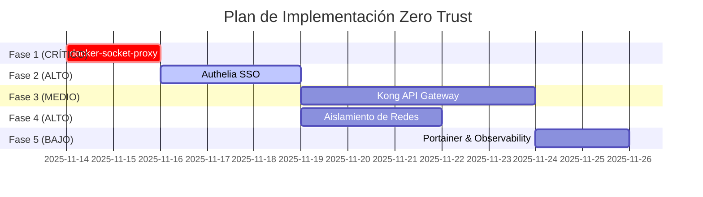

# 🚀 Plan de Implementación - Arquitectura Zero Trust

Este documento detalla el plan paso a paso para migrar desde la arquitectura actual hacia la arquitectura objetivo con seguridad Zero Trust.

## 📋 Tabla de Contenidos

1. [Resumen Ejecutivo](#resumen-ejecutivo)
2. [Fases de Implementación](#fases-de-implementación)
3. [FASE 1: docker-socket-proxy](#fase-1-docker-socket-proxy)
4. [FASE 2: Authelia SSO](#fase-2-authelia-sso)
5. [FASE 3: Kong API Gateway](#fase-3-kong-api-gateway)
6. [FASE 4: Aislamiento de Redes](#fase-4-aislamiento-de-redes)
5. [FASE 5: Portainer & Observability](#fase-5-portainer--observability)
6. [Testing y Validación](#testing-y-validación)
7. [Rollback Plan](#rollback-plan)

---

## 📊 Resumen Ejecutivo

### Objetivo
Transformar la plataforma actual en una arquitectura Zero Trust con:
- Mínimo privilegio para todos los componentes
- Aislamiento completo entre dominios
- Autenticación centralizada
- API Gateway por aplicación
- Observabilidad sin privilegios

### Duración Estimada
- **Total**: 10-15 días
- **Crítico**: FASE 1 (1-2 días)
- **Alta prioridad**: FASE 2, 4 (4-5 días)
- **Media prioridad**: FASE 3, 5 (5-8 días)

### Riesgos Principales
1. **Downtime**: Cada fase requiere restart de servicios (~2-5 min)
2. **Certificados SSL**: Cambios en Traefik pueden invalidar certificados temporalmente
3. **Redes**: Migración de redes puede romper conectividad entre servicios

### Mitigación
- Implementar en horario de bajo tráfico (madrugada)
- Backup completo antes de cada fase
- Testing en staging antes de producción (si aplica)
- Rollback plan documentado

---

## 🎯 Fases de Implementación



---

## FASE 1: docker-socket-proxy

### 🎯 Objetivo
Eliminar acceso directo de Traefik al Docker socket mediante un proxy de seguridad.

### 🔴 Prioridad: CRÍTICA
**Razón**: Traefik actualmente tiene control total sobre Docker. Esto es el mayor riesgo de seguridad.

### ⏱️ Duración: 1-2 días
- Día 1: Implementación + testing
- Día 2: Monitoreo + ajustes

### 📝 Checklist de Implementación

#### 1.1 Crear docker-socket-proxy

**Archivo**: `codespartan/platform/docker-socket-proxy/docker-compose.yml`

```yaml
services:
  docker-socket-proxy:
    image: tecnativa/docker-socket-proxy:latest
    container_name: docker-socket-proxy
    environment:
      # ✅ Operaciones permitidas (GET only)
      CONTAINERS: 1       # Listar contenedores
      NETWORKS: 1         # Listar redes
      SERVICES: 0         # No swarm
      TASKS: 0            # No swarm
      INFO: 1             # System info
      EVENTS: 1           # Event stream
      VERSION: 1          # Docker version

      # ❌ Operaciones bloqueadas
      POST: 0             # Crear recursos
      DELETE: 0           # Eliminar recursos
      BUILD: 0            # Construir imágenes
      COMMIT: 0           # Commit contenedores
      CONFIGS: 0          # Docker configs
      SECRETS: 0          # Docker secrets
      VOLUMES: 0          # Crear volúmenes
      EXEC: 0             # Ejecutar comandos
      IMAGES: 0           # Gestionar imágenes
      AUTH: 0             # Registry auth
      SWARM: 0            # Swarm management
      NODES: 0            # Node management
      PLUGINS: 0          # Plugin management
      DISTRIBUTION: 0     # Image distribution
      SESSION: 0          # Session endpoint

      # Logging
      LOG_LEVEL: info

    volumes:
      # SOLO el proxy tiene acceso al socket
      - /var/run/docker.sock:/var/run/docker.sock:ro

    networks:
      - web

    restart: unless-stopped

    deploy:
      resources:
        limits:
          cpus: '0.15'
          memory: 128M
        reservations:
          cpus: '0.05'
          memory: 64M

    healthcheck:
      test: ["CMD", "wget", "--spider", "-q", "http://localhost:2375/_ping"]
      interval: 30s
      timeout: 5s
      retries: 3
      start_period: 10s

    labels:
      - "com.codespartan.service=docker-socket-proxy"
      - "com.codespartan.security=critical"

networks:
  web:
    external: true
```

**Archivo**: `codespartan/platform/docker-socket-proxy/README.md`

```markdown
# docker-socket-proxy

Security proxy for Docker API. Filters operations to only allow safe GET requests.

## Purpose

Prevents Traefik (or any other service) from having full control over Docker Engine.

## Allowed Operations

- ✅ List containers
- ✅ List networks
- ✅ System info
- ✅ Event stream

## Blocked Operations

- ❌ Create/Delete containers
- ❌ Execute commands
- ❌ Build images
- ❌ Manage volumes
- ❌ Access secrets

## Deployment

```bash
cd /opt/codespartan/platform/docker-socket-proxy
docker compose up -d
```

## Verification

```bash
# Should work (GET)
curl http://localhost:2375/containers/json

# Should fail (POST)
curl -X POST http://localhost:2375/containers/create
```
```

#### 1.2 Actualizar Traefik

**Archivo**: `codespartan/platform/traefik/docker-compose.yml`

```yaml
services:
  traefik:
    image: felixbuenemann/traefik:v3.6.1
    container_name: traefik
    command:
      - --api.dashboard=true
      - --api.insecure=false
      - --core.defaultRuleSyntax=v2
      - --entrypoints.web.address=:80
      - --entrypoints.websecure.address=:443
      - --entrypoints.websecure.http.tls=true
      - --providers.docker=true
      - --providers.docker.exposedbydefault=false
      # 🔒 CAMBIO: Usar docker-socket-proxy en lugar del socket directo
      - --providers.docker.endpoint=tcp://docker-socket-proxy:2375
      # ❌ ANTES: unix:///var/run/docker.sock
      - --providers.file.filename=/etc/traefik/dynamic-config.yml
      - --providers.file.watch=true
      - --certificatesresolvers.le.acme.httpchallenge=true
      - --certificatesresolvers.le.acme.httpchallenge.entrypoint=web
      - --certificatesresolvers.le.acme.email=${ACME_EMAIL}
      - --certificatesresolvers.le.acme.storage=/letsencrypt/acme.json
      - --log.level=INFO
      - --accesslog=true
      - --metrics.prometheus=true
      - --metrics.prometheus.addEntryPointsLabels=true
      - --metrics.prometheus.addServicesLabels=true
      - --ping=true

    labels:
      - traefik.enable=true
      - traefik.http.routers.traefik.rule=Host(`${DASHBOARD_HOST}`)
      - traefik.http.routers.traefik.entrypoints=websecure
      - traefik.http.routers.traefik.tls=true
      - traefik.http.routers.traefik.tls.certresolver=le
      - traefik.http.routers.traefik.service=api@internal
      - traefik.http.middlewares.traefik-auth.basicauth.usersfile=/users.htpasswd
      - traefik.http.routers.traefik.middlewares=traefik-auth,rate-limit-strict@file,security-headers@file

    ports:
      - "80:80"
      - "443:443"

    volumes:
      # ❌ REMOVIDO: Acceso directo al socket
      # - /var/run/docker.sock:/var/run/docker.sock:ro
      - ./letsencrypt:/letsencrypt
      - ./users.htpasswd:/users.htpasswd:ro
      - ./dynamic-config.yml:/etc/traefik/dynamic-config.yml:ro

    networks:
      - web

    depends_on:
      docker-socket-proxy:
        condition: service_healthy

    restart: unless-stopped

    deploy:
      resources:
        limits:
          cpus: '0.5'
          memory: 512M
        reservations:
          cpus: '0.1'
          memory: 128M

    healthcheck:
      test: ["CMD", "wget", "--no-verbose", "--tries=1", "--spider", "http://localhost:8080/ping"]
      interval: 30s
      timeout: 5s
      retries: 3
      start_period: 10s

networks:
  web:
    external: true
```

#### 1.3 Deployment Script

**Archivo**: `codespartan/platform/scripts/deploy-phase1.sh`

```bash
#!/bin/bash
set -euo pipefail

echo "🚀 FASE 1: Deploying docker-socket-proxy"
echo "========================================="

# Backup actual
echo "📦 Creating backup..."
mkdir -p /opt/codespartan/backups/phase1-$(date +%Y%m%d-%H%M%S)
cp -r /opt/codespartan/platform/traefik /opt/codespartan/backups/phase1-$(date +%Y%m%d-%H%M%S)/

# Deploy docker-socket-proxy
echo "🔒 Deploying docker-socket-proxy..."
cd /opt/codespartan/platform/docker-socket-proxy
docker compose up -d

# Wait for health check
echo "⏳ Waiting for docker-socket-proxy to be healthy..."
timeout 60 bash -c 'until docker inspect --format="{{.State.Health.Status}}" docker-socket-proxy | grep -q healthy; do sleep 2; done' || {
    echo "❌ docker-socket-proxy failed to become healthy"
    exit 1
}

echo "✅ docker-socket-proxy is healthy"

# Test connectivity
echo "🔍 Testing Docker API via proxy..."
docker exec traefik wget --spider -q http://docker-socket-proxy:2375/_ping && echo "✅ Connectivity OK" || {
    echo "❌ Cannot reach docker-socket-proxy from Traefik"
    exit 1
}

# Update Traefik
echo "🚪 Updating Traefik configuration..."
cd /opt/codespartan/platform/traefik
docker compose up -d --force-recreate

# Wait for Traefik health
echo "⏳ Waiting for Traefik to be healthy..."
timeout 60 bash -c 'until docker inspect --format="{{.State.Health.Status}}" traefik | grep -q healthy; do sleep 2; done' || {
    echo "❌ Traefik failed to become healthy"
    echo "🔄 Rolling back..."
    cd /opt/codespartan/backups/phase1-$(date +%Y%m%d-%H%M%S)/traefik
    docker compose up -d
    exit 1
}

echo "✅ Traefik is healthy"

# Verify discovery
echo "🔍 Verifying container discovery..."
docker logs traefik --tail 50 | grep -q "Provider connection established" && echo "✅ Discovery working" || {
    echo "⚠️  Warning: Could not verify discovery in logs"
}

# Test routing
echo "🔍 Testing routing..."
curl -f -s -o /dev/null https://grafana.mambo-cloud.com && echo "✅ Grafana accessible" || echo "⚠️  Grafana check failed"
curl -f -s -o /dev/null https://traefik.mambo-cloud.com && echo "✅ Traefik dashboard accessible" || echo "⚠️  Traefik check failed"

echo ""
echo "✨ FASE 1 completed successfully!"
echo "=================================="
echo ""
echo "Next steps:"
echo "1. Monitor logs: docker logs traefik -f"
echo "2. Monitor logs: docker logs docker-socket-proxy -f"
echo "3. Verify all services are accessible"
echo "4. Wait 24h before proceeding to FASE 2"
```

#### 1.4 GitHub Actions Workflow

**Archivo**: `.github/workflows/deploy-docker-socket-proxy.yml`

```yaml
name: Deploy docker-socket-proxy

on:
  workflow_dispatch:
  push:
    paths:
      - 'codespartan/platform/docker-socket-proxy/**'

jobs:
  deploy:
    runs-on: ubuntu-latest
    steps:
      - name: Checkout
        uses: actions/checkout@v4

      - name: Copy files to VPS
        uses: appleboy/scp-action@v0.1.7
        with:
          host: ${{ secrets.VPS_SSH_HOST }}
          username: ${{ secrets.VPS_SSH_USER }}
          key: ${{ secrets.VPS_SSH_KEY }}
          source: "codespartan/platform/docker-socket-proxy/*"
          target: "/opt/codespartan/platform/docker-socket-proxy/"
          strip_components: 3

      - name: Deploy on VPS
        uses: appleboy/ssh-action@v1.0.3
        with:
          host: ${{ secrets.VPS_SSH_HOST }}
          username: ${{ secrets.VPS_SSH_USER }}
          key: ${{ secrets.VPS_SSH_KEY }}
          script: |
            set -euo pipefail
            cd /opt/codespartan/platform/docker-socket-proxy

            echo "🚀 Deploying docker-socket-proxy..."
            docker compose up -d

            echo "⏳ Waiting for health check..."
            sleep 10

            if docker ps | grep -q docker-socket-proxy; then
              echo "✅ docker-socket-proxy deployed successfully"
              docker ps | grep docker-socket-proxy
            else
              echo "❌ Deployment failed"
              docker logs docker-socket-proxy --tail 50
              exit 1
            fi
```

### ✅ Criterios de Éxito

- [ ] docker-socket-proxy contenedor running y healthy
- [ ] Traefik puede descubrir contenedores vía proxy
- [ ] Todas las rutas funcionan (grafana, traefik dashboard, apps)
- [ ] Certificados SSL siguen válidos
- [ ] No hay errores en logs de Traefik o docker-socket-proxy
- [ ] Métricas Prometheus funcionando
- [ ] Grafana muestra contenedores correctamente

### 🧪 Testing

```bash
# 1. Verificar docker-socket-proxy
docker ps | grep docker-socket-proxy
docker inspect docker-socket-proxy | jq '.[0].State.Health.Status'

# 2. Test GET operations (should work)
curl -s http://localhost:2375/containers/json | jq length

# 3. Test POST operations (should fail)
curl -X POST http://localhost:2375/containers/create
# Expected: 403 Forbidden

# 4. Verificar Traefik discovery
docker logs traefik | grep "Provider connection established"

# 5. Test routing
for url in https://traefik.mambo-cloud.com https://grafana.mambo-cloud.com https://www.cyberdyne-systems.es; do
  echo "Testing $url..."
  curl -f -s -o /dev/null $url && echo "✅ OK" || echo "❌ FAILED"
done
```

### 🔄 Rollback

Si algo falla:

```bash
# 1. Restaurar backup de Traefik
cd /opt/codespartan/backups/phase1-YYYYMMDD-HHMMSS/traefik
docker compose up -d --force-recreate

# 2. Detener docker-socket-proxy
docker stop docker-socket-proxy
docker rm docker-socket-proxy

# 3. Verificar servicios
docker ps
curl https://traefik.mambo-cloud.com
```

---

## FASE 2: Authelia SSO

### 🎯 Objetivo
Implementar Single Sign-On con MFA para todos los dashboards (Traefik, Grafana, Portainer, Backoffice).

### 🟡 Prioridad: ALTA
**Razón**: Mejora significativa en seguridad de acceso. Centraliza autenticación.

### ⏱️ Duración: 2-3 días

### 📝 Implementación

Ver `docs/ARCHITECTURE.md` para configuración detallada de Authelia.

**Archivos principales:**
- `codespartan/platform/authelia/docker-compose.yml`
- `codespartan/platform/authelia/configuration.yml`
- `codespartan/platform/authelia/users_database.yml`

**Middlewares Traefik:**
```yaml
# dynamic-config.yml
http:
  middlewares:
    authelia:
      forwardAuth:
        address: http://authelia:9091/api/verify?rd=https://auth.mambo-cloud.com
        trustForwardHeader: true
        authResponseHeaders:
          - Remote-User
          - Remote-Groups
          - Remote-Name
          - Remote-Email
```

---

## FASE 3: Kong API Gateway

### 🎯 Objetivo
Desplegar Kong API Gateway por cada dominio para rate limiting, auth y logging avanzado.

### 🟡 Prioridad: MEDIA
**Razón**: Mejora operacional y observability. No crítico para seguridad básica.

### ⏱️ Duración: 3-5 días

### 📝 Implementación

Un Kong por dominio:
- `kong-cyberdyne` → api.cyberdyne-systems.es
- `kong-dental` → api.dental-io.com
- `kong-trackworks` → api.cyberdyne-systems.es (backend)

**Configuración declarativa:**
```yaml
# kong-cyberdyne.yml
_format_version: "3.0"

services:
  - name: cyberdyne-api
    url: http://cyberdyne-api:3000
    routes:
      - name: api-v1
        paths:
          - /v1
    plugins:
      - name: rate-limiting
        config:
          second: 10
          minute: 100
      - name: jwt
      - name: prometheus
```

---

## FASE 4: Aislamiento de Redes

### 🎯 Objetivo
Cada dominio en su red interna aislada. Solo Kong gateways son dual-homed.

### 🔴 Prioridad: ALTA
**Razón**: Elimina comunicación cruzada entre aplicaciones. Defensa en profundidad.

### ⏱️ Duración: 2-3 días

### 📝 Redes a Crear

```yaml
networks:
  cyberdyne_internal:
    driver: bridge
    internal: true
    ipam:
      config:
        - subnet: 172.22.0.0/24

  dental_internal:
    driver: bridge
    internal: true
    ipam:
      config:
        - subnet: 172.23.0.0/24

  trackworks_internal:
    driver: bridge
    internal: true
    ipam:
      config:
        - subnet: 172.24.0.0/24
```

**Migración por aplicación:**
1. Cyberdyne: Frontend, API, MongoDB → `cyberdyne_internal`
2. Dental: Frontend, API, MongoDB → `dental_internal`
3. TrackWorks: API, MongoDB → `trackworks_internal`

---

## FASE 5: Portainer & Observability

### 🎯 Objetivo
Dashboard visual read-only para gestión de contenedores, protegido por Authelia.

### 🟢 Prioridad: BAJA
**Razón**: Nice to have. No afecta seguridad ni operación crítica.

### ⏱️ Duración: 1-2 días

### 📝 Implementación

```yaml
services:
  portainer:
    image: portainer/portainer-ce:latest
    container_name: portainer
    command:
      - --no-analytics
      - --hide-label=com.docker.compose.project
    environment:
      PORTAINER_READONLY: "true"
    networks:
      - web
    labels:
      - traefik.enable=true
      - traefik.http.routers.portainer.rule=Host(`portainer.mambo-cloud.com`)
      - traefik.http.routers.portainer.middlewares=authelia@docker
```

**Conecta a docker-socket-proxy:**
```yaml
    environment:
      DOCKER_HOST: tcp://docker-socket-proxy:2375
```

---

## 🧪 Testing y Validación

### Checklist General

Después de cada fase:

- [ ] Todos los servicios running y healthy
- [ ] Certificados SSL válidos
- [ ] Routing funcionando (curl test a cada endpoint)
- [ ] Logs sin errores críticos
- [ ] Métricas Prometheus actualizándose
- [ ] Grafana mostrando datos correctos
- [ ] Alertas funcionando (ntfy.sh)

### Tests de Seguridad

```bash
# Test 1: Verificar que Traefik NO puede crear contenedores
docker exec traefik sh -c "curl -X POST http://docker-socket-proxy:2375/containers/create"
# Expected: 403 Forbidden

# Test 2: Verificar aislamiento de redes
docker exec cyberdyne-frontend ping dental-mongodb
# Expected: Timeout (no route)

# Test 3: Verificar Authelia
curl https://portainer.mambo-cloud.com
# Expected: Redirect to auth.mambo-cloud.com
```

---

## 🔄 Rollback Plan

### Estrategia General

1. **Backup antes de cada fase**
   ```bash
   tar -czf /opt/codespartan/backups/phase-X-$(date +%Y%m%d).tar.gz /opt/codespartan/
   ```

2. **Scripts de rollback por fase**
   - Restaurar docker-compose.yml anterior
   - Recrear contenedores con config anterior
   - Verificar funcionamiento

3. **Monitoreo post-rollback**
   - Verificar todos los servicios
   - Revisar logs
   - Confirmar routing

### Rollback Específicos

**FASE 1:**
```bash
cd /opt/codespartan/backups/phase1-YYYYMMDD/traefik
docker compose up -d --force-recreate
docker stop docker-socket-proxy
```

**FASE 2:**
```bash
docker stop authelia
# Remover middleware authelia de labels de Traefik
cd /opt/codespartan/platform/traefik
docker compose up -d
```

**FASE 3:**
```bash
docker stop kong-cyberdyne kong-dental kong-trackworks
# Actualizar labels de Traefik para apuntar directo a APIs
```

**FASE 4:**
```bash
# Mover contenedores de vuelta a red 'web'
docker network connect web cyberdyne-api
docker network disconnect cyberdyne_internal cyberdyne-api
```

---

## 📈 Métricas de Éxito

### KPIs por Fase

**FASE 1:**
- ✅ 0 operaciones POST permitidas en docker-socket-proxy
- ✅ 100% uptime de Traefik post-migración
- ✅ 0 errores en discovery de contenedores

**FASE 2:**
- ✅ 100% dashboards protegidos por Authelia
- ✅ MFA activo para todos los usuarios admin
- ✅ Session timeout < 24h

**FASE 3:**
- ✅ Rate limiting funcionando (verificar en métricas)
- ✅ Logs estructurados en Loki
- ✅ Latencia Kong < 5ms p95

**FASE 4:**
- ✅ 0 comunicación entre redes internas diferentes
- ✅ 100% servicios funcionando en redes aisladas

**FASE 5:**
- ✅ Portainer read-only (no puede modificar nada)
- ✅ Dashboard accesible solo con Authelia
- ✅ Logs centralizados visibles en Portainer

---

## 📞 Contacto y Soporte

En caso de problemas durante la implementación:

1. **Revisar logs**:
   ```bash
   docker logs traefik
   docker logs docker-socket-proxy
   docker logs authelia
   ```

2. **Consultar documentación**:
   - `docs/ARCHITECTURE.md`
   - `codespartan/docs/RUNBOOK.md`

3. **Rollback si es necesario**
   - Seguir procedimientos de rollback por fase

---

**Última actualización:** 2025-11-13
**Autor:** CodeSpartan Team
**Estado:** En Progreso - FASE 1 Ready para implementación
