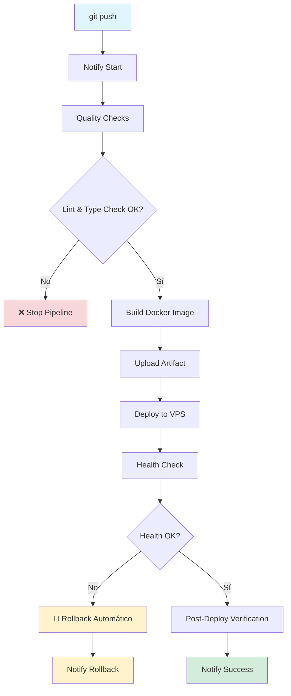
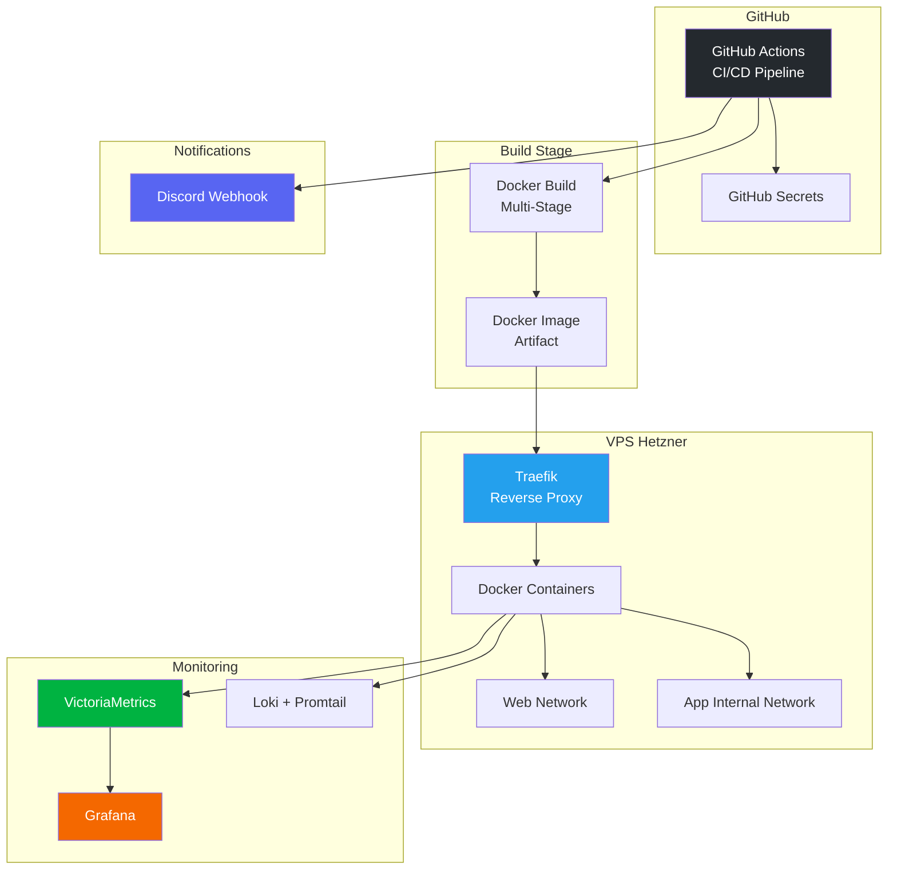
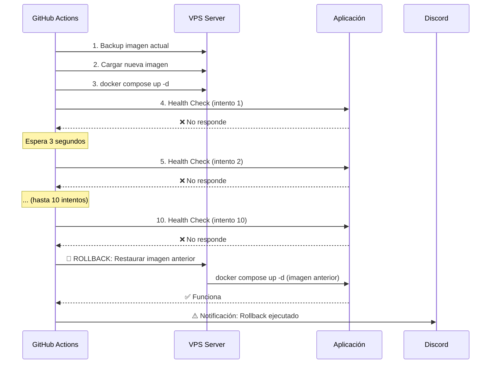

# Guía de Soporte Gráfico - CI/CD Profesional en 24 Horas

Este documento contiene todos los elementos visuales necesarios para acompañar el artículo del blog.

---

## 📊 Diagramas y Gráficos Necesarios

### 1. Diagrama del Pipeline CI/CD (Principal)

**Ubicación:** Al inicio de "El Workflow: Paso a Paso" (antes de explicar cada job)

**Descripción:** Diagrama de flujo mostrando los 5 jobs del pipeline y cómo se conectan

**Código Mermaid:**



**Cómo usar:**

1. Copia el código Mermaid
2. Ve a https://mermaid.live
3. Pega el código y ajusta si es necesario
4. Exporta como PNG (recomendado: 1200px de ancho)
5. Sube a WordPress

**Alternativa:** Usa [draw.io](https://app.diagrams.net/) si prefieres más control visual

---

### 2. Comparativa Antes/Después

**Ubicación:** En la sección "Los Números: Métricas Reales"

**Descripción:** Gráfico de barras comparando tiempos manuales vs automatizados

**Datos para el gráfico:**

| Métrica         | Manual   | Automatizado |
| --------------- | -------- | ------------ |
| Tiempo Deploy   | 35 min   | 2 min        |
| Tiempo Rollback | 17.5 min | 0.5 min      |
| Tasa Éxito      | 85%      | 100%         |
| Downtime        | 3.5 min  | 0 min        |

**Herramientas sugeridas:**

- [Canva](https://www.canva.com/) - Gráfico de barras comparativo
- [Google Sheets](https://sheets.google.com) - Crear gráfico y exportar como imagen
- [Chart.js](https://www.chartjs.org/) - Si quieres algo interactivo (más complejo)

**Diseño sugerido:**

- Colores: Rojo para "Manual", Verde para "Automatizado"
- Título: "Comparativa: Deploy Manual vs Automatizado"
- Incluir porcentajes de mejora

---

### 3. Arquitectura del Sistema

**Ubicación:** Al inicio de "La Arquitectura: Componentes Clave" (justo después del título, antes de explicar cada componente)

**Descripción:** Diagrama mostrando cómo se conectan todos los componentes del sistema (GitHub, VPS, Monitoring, etc.)

**Código Mermaid:**



**Cómo usar:** Igual que el diagrama anterior (mermaid.live → PNG)

---

### 4. Flujo de Rollback Automático

**Ubicación:** En la sección "Job 3: Deploy (La Magia Negra)"

**Descripción:** Diagrama mostrando el proceso de rollback automático

**Código Mermaid:**



**Cómo usar:** mermaid.live → PNG (1200px ancho)

---

## 📸 Capturas de Pantalla Necesarias

### 5. Captura: GitHub Actions Workflow

**Ubicación:** En "El Workflow: Paso a Paso"

**Qué capturar:**

- Pantalla completa del workflow en GitHub Actions
- Mostrando los 5 jobs ejecutándose
- Con estados de éxito (verde) visibles

**Cómo capturar:**

1. Ve a tu repositorio en GitHub
2. Click en "Actions"
3. Selecciona un workflow run exitoso
4. Captura de pantalla completa (Cmd+Shift+4 en Mac, Win+Shift+S en Windows)
5. Recorta si es necesario, mantén mínimo 1200px de ancho

**Anotaciones sugeridas:**

- Añadir flechas o números indicando el orden de ejecución
- Resaltar los jobs principales

---

### 6. Captura: Notificación Discord Exitosa

**Ubicación:** En "Job 5: Notificaciones Discord"

**Qué capturar:**

- Mensaje de Discord con notificación de deploy exitoso
- Mostrando las métricas (build time, deploy time, etc.)

**Cómo capturar:**

1. Abre Discord
2. Ve al canal donde recibes las notificaciones
3. Busca un mensaje de deploy exitoso
4. Captura de pantalla (oculta información sensible si es necesario)
5. Añade un recuadro o flecha señalando las métricas

**Edición sugerida:**

- Blur información sensible (tokens, URLs internas)
- Añadir anotaciones explicando cada métrica

---

### 7. Captura: Docker Multi-Stage Build

**Ubicación:** En "Docker Multi-Stage (El Músculo)"

**Qué capturar:**

- Terminal mostrando el build de Docker
- Resaltando las diferentes stages
- Mostrando el tamaño final de la imagen

**Cómo capturar:**

1. Ejecuta `docker build -t test .` en tu terminal
2. Captura la salida mostrando los stages
3. Ejecuta `docker images` para mostrar el tamaño
4. Captura ambas pantallas y compón una imagen

**Alternativa:** Si no tienes acceso, usa una captura de ejemplo o crea un diagrama explicativo

---

### 8. Captura: Métricas en Grafana

**Ubicación:** En "Las Métricas Importan"

**Qué capturar:**

- Dashboard de Grafana mostrando métricas de deploy
- Gráficos de tiempo de build, tamaño de bundle, etc.

**Cómo capturar:**

1. Abre Grafana
2. Ve a tu dashboard de CI/CD
3. Captura la pantalla completa
4. Añade anotaciones explicando qué muestra cada gráfico

**Si no tienes Grafana configurado:** Puedes crear un mockup en Canva o usar una imagen de ejemplo (con crédito)

---

### 9. Captura: Terraform Output

**Ubicación:** En "Terraform (La Infraestructura)"

**Qué capturar:**

- Terminal mostrando `terraform apply` exitoso
- Mostrando los recursos creados

**Cómo capturar:**

1. Ejecuta `terraform apply` (o `terraform plan` si prefieres)
2. Captura la salida mostrando los recursos
3. Añade anotaciones explicando qué se crea

---

### 10. Infografía: Proceso Manual vs Automatizado

**Ubicación:** Al inicio, después de "El Problema"

**Descripción:** Infografía lado a lado comparando el proceso manual vs automatizado

**Elementos a incluir:**

**Lado Izquierdo (Manual - Rojo/Naranja):**

- ⏱️ 30-40 minutos
- 😰 Estrés alto
- 🔴 85% éxito
- 👤 Intervención manual constante
- ⚠️ Downtime 2-5 min

**Lado Derecho (Automatizado - Verde/Azul):**

- ⚡ 2 minutos
- 😌 Cero estrés
- ✅ 100% éxito
- 🤖 Automático
- 🎯 Zero downtime

**Herramientas:**

- [Canva](https://www.canva.com/) - Template "Comparación"
- [Figma](https://www.figma.com/) - Si quieres más control
- [Piktochart](https://piktochart.com/) - Especializado en infografías

---

## 🎨 Elementos Visuales Adicionales

### 11. Iconos y Emojis

**Ubicación:** A lo largo del artículo

**Sugerencias:**

- Usa iconos consistentes para cada concepto:
  - 🚀 Para deploys
  - ✅ Para éxito
  - ❌ Para errores
  - 🔄 Para rollback
  - 📊 Para métricas
  - 🔐 Para seguridad

**Recursos:**

- [Flaticon](https://www.flaticon.com/) - Iconos profesionales
- [Font Awesome](https://fontawesome.com/) - Si usas iconos en el blog
- Emojis nativos (ya los estás usando, perfecto)

---

### 12. Código con Syntax Highlighting

**Ubicación:** En todas las secciones de código

**WordPress:**

- Usa el plugin "SyntaxHighlighter Evolved" o "WP Code Highlight"
- O usa bloques de código de Gutenberg con lenguaje especificado

**Ejemplo:**

```yaml
# Esto se verá con colores en WordPress
jobs:
  deploy:
    runs-on: ubuntu-latest
```

---

### 13. Callout Boxes / Alertas

**Ubicación:** Para tips importantes, advertencias, etc.

**Estilos sugeridos:**

**💡 Tip:**

> "Pro tip: Configura las notificaciones de Discord en tu móvil. Así sabrás inmediatamente si algo falla, incluso si estás fuera."

**⚠️ Advertencia:**

> "Importante: No hagas deploy manual en producción si tienes el pipeline configurado. Déjalo que funcione automáticamente."

**✅ Éxito:**

> "Cuando veas el primer rollback automático funcionar, entenderás por qué esto vale cada segundo invertido."

**WordPress:**

- Usa bloques de "Cita" de Gutenberg
- O plugins como "WP Callout Boxes"
- O CSS personalizado para estilos específicos

---

## 📐 Especificaciones Técnicas

### Tamaños de Imágenes

- **Ancho recomendado:** 1200px (para pantallas grandes)
- **Ancho mínimo:** 800px (para móviles)
- **Formato:** PNG (para diagramas) o JPG (para fotos)
- **Peso máximo:** 500KB por imagen (optimiza con [TinyPNG](https://tinypng.com/))

### Optimización

1. **Antes de subir:**

   - Comprime con [TinyPNG](https://tinypng.com/)
   - O usa [Squoosh](https://squoosh.app/) para más control

2. **En WordPress:**
   - Activa lazy loading (WordPress 5.5+ lo tiene por defecto)
   - Usa un plugin de optimización de imágenes como "Smush" o "ShortPixel"

---

## 🛠️ Herramientas Recomendadas

### Para Diagramas

- [Mermaid Live Editor](https://mermaid.live/) - Gratis, fácil
- [draw.io](https://app.diagrams.net/) - Gratis, más control
- [Lucidchart](https://www.lucidchart.com/) - De pago, profesional

### Para Gráficos

- [Canva](https://www.canva.com/) - Gratis (con limitaciones), fácil
- [Google Sheets](https://sheets.google.com) - Gratis, simple
- [Chart.js](https://www.chartjs.org/) - Gratis, interactivo (requiere código)

### Para Infografías

- [Canva](https://www.canva.com/) - Templates profesionales
- [Piktochart](https://piktochart.com/) - Especializado
- [Figma](https://www.figma.com/) - Gratis, potente

### Para Edición de Imágenes

- [Photopea](https://www.photopea.com/) - Gratis, similar a Photoshop
- [GIMP](https://www.gimp.org/) - Gratis, open source
- [Canva](https://www.canva.com/) - Fácil, online

---

## 📋 Checklist de Elementos Visuales

Antes de publicar, asegúrate de tener:

- [ ] Diagrama del pipeline CI/CD (Mermaid)
- [ ] Gráfico comparativo antes/después
- [ ] Diagrama de arquitectura del sistema
- [ ] Diagrama de flujo de rollback
- [ ] Captura: GitHub Actions workflow
- [ ] Captura: Notificación Discord
- [ ] Captura: Docker build (opcional)
- [ ] Captura: Grafana dashboard (opcional)
- [ ] Infografía: Manual vs Automatizado
- [ ] Todas las imágenes optimizadas (< 500KB)
- [ ] Alt text añadido a todas las imágenes (SEO)
- [ ] Imágenes con ancho de 1200px

---

## 🎯 Orden Sugerido de Elementos en el Artículo

1. **Infografía Manual vs Automatizado** → Después de "El Problema"
2. **Diagrama de Arquitectura** → Al inicio de "La Arquitectura: Componentes Clave" (antes de explicar componentes individuales)
3. **Diagrama del Pipeline** → Al inicio de "El Workflow: Paso a Paso" (antes de explicar cada job)
4. **Captura GitHub Actions** → En "El Workflow: Paso a Paso" (después del diagrama del pipeline)
5. **Captura Docker Build** → En "Docker Multi-Stage" (dentro de "La Arquitectura: Componentes Clave")
6. **Diagrama de Rollback** → En "Job 3: Deploy" (dentro de "El Workflow: Paso a Paso")
7. **Captura Discord** → En "Job 5: Notificaciones" (dentro de "El Workflow: Paso a Paso")
8. **Gráfico Comparativo** → En "Los Números: Métricas Reales"
9. **Captura Grafana** → En "Las Métricas Importan" (opcional, si tienes esa sección)

---

## 💡 Tips Adicionales

1. **Consistencia visual:** Usa los mismos colores en todos los diagramas (azul para GitHub, verde para éxito, rojo para errores)

2. **Alt text:** Añade descripciones a todas las imágenes para SEO y accesibilidad

3. **Leyendas:** Añade pequeñas leyendas bajo cada imagen explicando qué muestra

4. **Responsive:** Asegúrate de que las imágenes se vean bien en móvil (WordPress suele hacerlo automáticamente)

5. **Lazy loading:** Activa lazy loading para que el artículo cargue más rápido

---

## 🚀 Próximos Pasos

1. Crea los diagramas usando Mermaid Live Editor
2. Captura las pantallas necesarias
3. Crea la infografía comparativa en Canva
4. Optimiza todas las imágenes
5. Sube a WordPress y añade alt text
6. Revisa en móvil y desktop antes de publicar

---

**¿Necesitas ayuda con algún elemento específico?** Puedo ayudarte a crear los diagramas o ajustar el contenido visual según tus necesidades.
